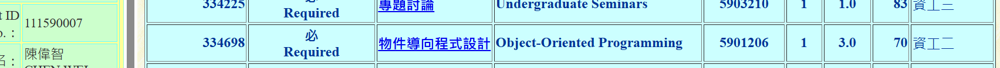
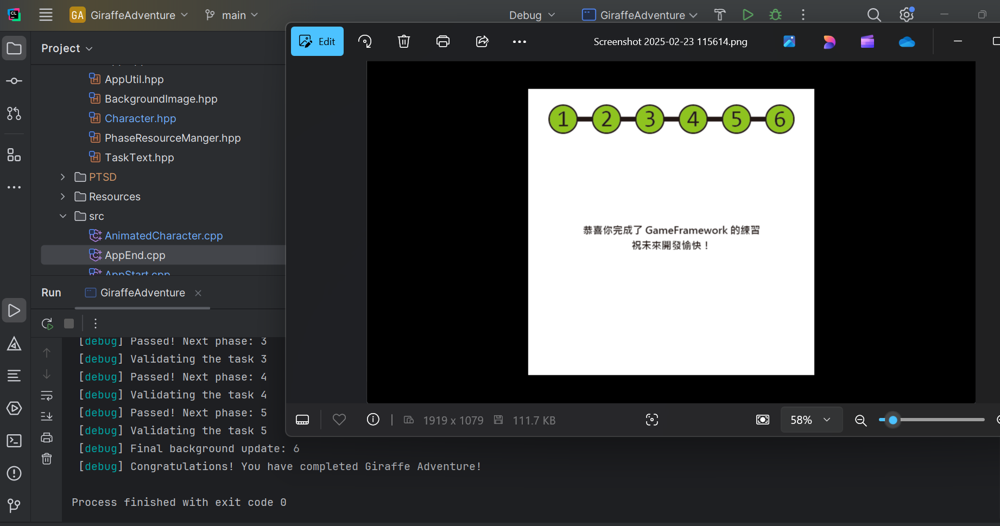
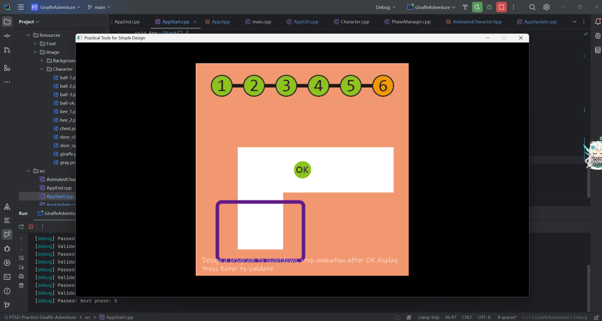

# Abstract

遊戲名稱：Jetpack Joyride

組員：

- 111590007 陳偉智
- 111590062 李其灝

# Game Introduction

按下鍵之後即開始遊戲，操控人物上下移動(按著會往上，放開會往下掉)，越久速度會增加，碰到障礙會死掉、分數制。

影片連結: https://www.youtube.com/watch?v=jhqUu4G4c6E

# Development timeline
(粗估暫定，視情況調整)
- Week 1：
  - 分析遊戲
  - 蒐集遊戲需要素材
- Week 2： 
  - 背景
  - 主選單
- Week 3： 
  - 鏡頭畫面移動，背景持續
- Week 4： 
  - 背景角色、雷射障礙物、錢幣、錢幣圖案、背景變換
- Week 5： 
  - 玩家、玩家移動控制、畫面移動時玩家保持位置
- Week 6： 
  - 吃到裝備時動畫、、玩家穿著裝備時的效果
- Week 7： 
  - 飛彈、飛彈來臨提示、飛彈軌跡
- Week 8： 
  - 碰撞規則實作 (玩家/玩家穿著裝備 /背景腳色觸碰障礙物、觸碰飛彈)
- Week 9： 
  - 裝備觸碰障礙物/飛彈爆炸返回一般玩家畫面
- Week 10： 
  - 玩家死亡效果(觸碰障礙物、被飛彈擊落)、背景腳色觸碰障礙物效果
- Week 11： 
  - 收集錢幣分數
  - 距離總計、最佳距離顯示
- Week 12： 
  - 畫面速度增加
- Week 13： 
  - 遊戲暫停功能
- Week 14： 
  - 關卡實作
- Week 15： 
  - 關卡實作、檢測是否有bug
- Week 16： 
  - (若前面做完) 角色造型、更多裝備造型、效果
- Week 17： 
  - 優化

# 預計關卡 (視情況調整)
遊戲本身背景會不斷變換，所以關卡沒有特定背景。背景: 實驗室、海底、草原、倉庫、森林、石頭

- 關卡1：  收集150枚金幣   
- 關卡2：  距離超過1000米  
- 關卡3：  與10位科學家擊掌且收集500枚錢幣 
- 關卡3：  一場遊戲中觸碰10盞燈、步行500米 
- 關卡4：  超過2000米、飛越10道電光
- 關卡5：  收集2枚旋轉紀念品且收集兩種裝備
- 關卡6：  玩完一場遊戲時間為1000至1300米
- 關卡7：  迂迴繞過10道電光
- 關卡8：  收集特定裝備3次
- 關卡9：  僥倖避開5枚導彈
- 關卡10： 僥倖避開5枚導彈、僥倖避開5道電光、至少收集一種裝備

# 物件導向程式設計

111590007 陳偉智

111590062 李其灝

# Giraffe_Adventure
111590007 陳偉智

111590062 李其灝
