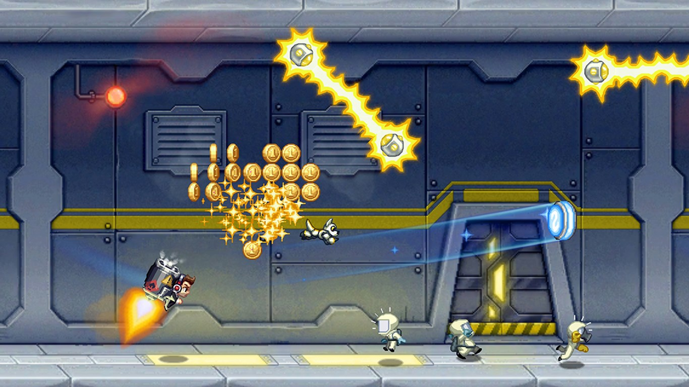

# Abstract

遊戲名稱：Jetpack Joyride

組員：

- 111590007 陳偉智
- 111590062 李其灝

# Game Introduction

按下鍵之後即開始遊戲，操控人物上下移動，越久速度會增加，碰到障礙會死掉、分數制。

# Development timeline

- Week 1：準備素材
  - 蒐集遊戲的素材
- Week 2：開始實作 (基本): 
  - 搭建場景
  - 障礙物、背景腳色、裝備、動畫
  - 角色控制
  - 規則、碰撞檢測、加速
  - 得分系統
  - 死亡、重新機制
- ...

# 物件導向程式設計

111590007 陳偉智

111590062 李其灝

# Giraffe_Adventure
