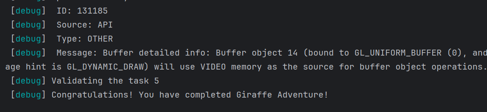

# Abstract

遊戲名稱： Angry Birds

組員：

- 111590454 洪俊瑋
- 111590452 李晨維

  

# Game Introduction

Angry Birds 是一款基於彈射物理的闖關遊戲，玩家需要利用彈弓發射各種特性的小鳥來摧毀敵方的結構，擊敗關卡中的所有豬頭敵人以獲得高分。遊戲包含多個關卡，並隨著進度提升難度，增加更多挑戰要素。

- 會死掉：如果玩家在使用所有小鳥後仍未能消滅所有豬頭敵人，則關卡失敗。
- 會獲勝：成功摧毀所有豬頭敵人即可過關。
- 有關卡：每個關卡都包含不同的地形、建築結構和敵人配置，並設有多種特殊效果的小鳥來協助玩家過關。

[遊戲影片](https://youtu.be/aiiQ8btusrs)

# Development timeline

- Week 1：準備素材  
  - [ ] 蒐集遊戲的素材  

- Week 2：處理遊戲的Layout  
  - [ ] 進行視覺設計
  - [ ] 設計遊戲的基本場景  

- Week 3 ：彈弓發射機制  
  - [ ] 設計並實作彈弓控制機制  
  - [ ] 設定發射角度與力度  
  - [ ] 設計小鳥的飛行軌跡   

- Week 4 5：物理碰撞 
  - [ ] 實現物理碰撞機制  

- Week 6：敵人機制  
  - [ ] 設計豬頭敵人的生命值與受擊反應  
  - [ ] 設定敵人消滅條件  

- Week 7 8：關卡與建築結構  
  - [ ] 設計可破壞的建築物  
  - [ ] 建立關卡內的障礙物與地形變化  

- Week 9 10：關卡挑戰與難度調整  
  - [ ] 增加關卡數量並設定難度遞增  

- Week 11：特殊小鳥設計  
  - [ ] 設計不同能力的小鳥，例如加速、爆炸、分裂等  
  - [ ] 確保小鳥的特殊能力影響遊戲策略  

- Week 12：特殊敵人  
  - [ ] 設計幾種特殊的豬頭敵人  
  - [ ] 讓特殊怪具有特殊的防禦能力  

- Week 13：UI 設計與優化  
  - [ ] 設計遊戲內的 UI，如得分、剩餘小鳥、關卡進度等  
  - [ ] 讓 UI 易於閱讀，並保持視覺美觀  

- Week 14 15 16：Bug 修正與遊戲優化  
  - [ ] 進行測試，修復可能影響遊戲體驗的 Bug  
  - [ ] 調整遊戲平衡性，確保關卡難度適當  
  - [ ] 確保所有遊戲機制正常運作，進行最後測試  
