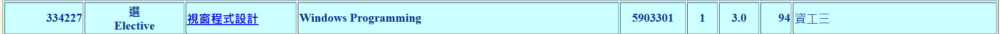

# Abstract

遊戲名稱： Arrow a row

組員：

- 111590454 洪俊瑋
- 111590452 李晨維

  

# Game Introduction

Arrow a Row 是一款自動跑步遊戲，玩家控制角色在關卡中自動前進，並透過左右移動來閃避障礙物和攻擊敵人和蒐集道具以強化能力。玩家的目標是擊敗最終的 BOSS 或生存更長時間以獲得更高分數，從而進入下一關挑戰更高難度的關卡。

- 會死掉：玩家碰到障礙物或被敵人攻擊過多次後，角色會死亡，遊戲結束。
- 會獲勝：擊敗最後的 BOSS 即可過關。
- 有關卡：遊戲包含多個關卡，每個關卡都有不同的敵人類型且難度會提升。

# Development timeline

- Week 1：準備素材  
  - [ ] 蒐集遊戲的素材  

- Week 2：處理遊戲的Layout  
  - [ ] 進行視覺設計
  - [ ] 設計遊戲的基本場景  

- Week 3：角色基本控制  
  - [ ] 決定數值設定  
  - [ ] 實作基本邏輯  

- Week 4：自動跑步與視角設計  
  - [ ] 設計角色自動前進機制  
  - [ ] 調整遊戲視角與畫面滾動方式  

- Week 5：攻擊機制開發  
  - [ ] 設計角色的自動發射箭矢機制  
  - [ ] 讓箭矢能擊中敵人並造成傷害  

- Week 6：敵人設計  
  - [ ] 設計基本敵人攻擊行為  
  - [ ] 增加敵人受傷與死亡的效果  

- Week 7 8：關卡基本架構  
  - [ ] 設計關卡場景
  
- Week 9：關卡難度與挑戰要素  
  - [ ] 設計敵人隨關卡變化的配置與強度調整  

- Week 10：道具與強化系統  
  - [ ] 設計可收集的道具，例如增加攻擊速度、傷害加成、護盾等  
  - [ ] 確保道具能夠影響角色能力  

- Week 11 12：BOSS 戰開發  
  - [ ] 設計 BOSS 戰機制與攻擊方式  
  
- Week 13：UI 設計與優化  
  - [ ] 完成遊戲內的 UI，如生命值、得分、關卡進度等  
  - [ ] 讓 UI 易於閱讀，並保持視覺美觀  

- Week 14 15 16：Bug 修正與遊戲平衡調整  
  - [ ] 進行測試，修復可能影響遊戲體驗的 Bug  
  - [ ] 調整遊戲平衡性，例如關卡難度、攻擊強度、敵人血量等  
  - [ ] 確保所有遊戲機制正常運作，進行最後測試 
  