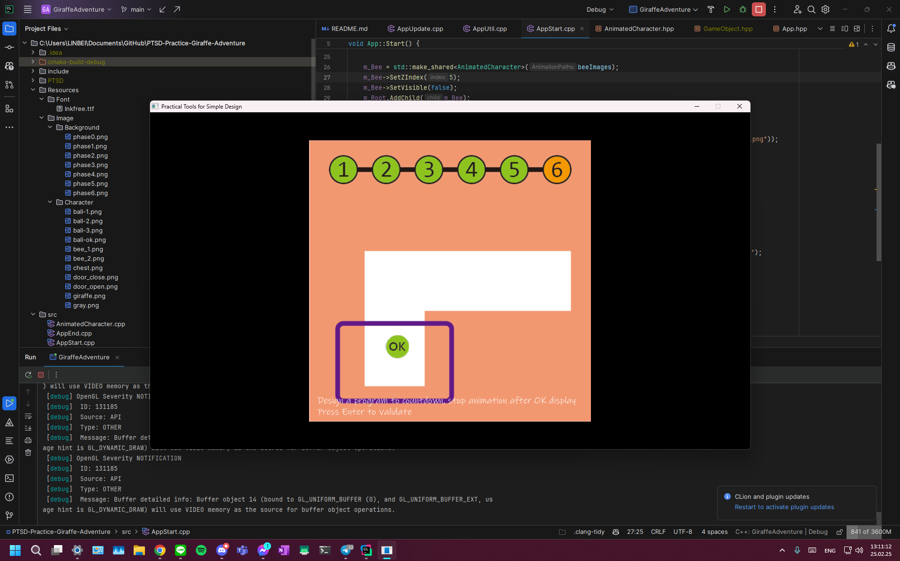
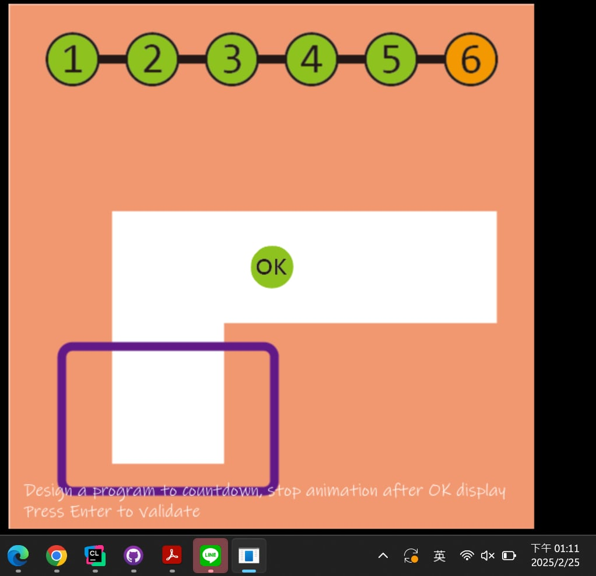
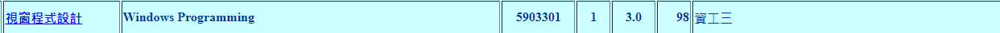
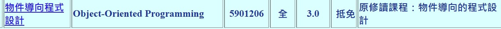

# Requirement

## Griaffe Advanture
1. 111590453 張竣崴  
[Git Repo](https://github.com/bradly0cjw/PTSD-Practice-Giraffe-Adventure)

2. 111590455 曾詮淳 

## 修課紀錄
1. 111590453 張竣崴

2. 111590455 曾詮淳

---
# Abstract

遊戲名稱：Bullet Storm

組員：

- 111590453 張竣崴
- 111590455 曾詮淳

# Game Introduction

《Bullet Storm》是一款類似經典射擊遊戲《[雷電（Raiden）](https://store.steampowered.com/app/570050/Raiden_V_Directors_Cut___V_Directors_Cut__V/?l=tchinese)》的垂直捲軸彈幕射擊遊戲。玩家將操控一架高科技戰機，穿越重重敵人與關卡，挑戰最終 Boss，並力求生存與獲勝。遊戲將包含以下核心要素：

- **會死掉**：玩家的戰機擁有有限的生命值，被敵方彈幕擊中則會損失生命，當生命值歸零時遊戲結束。
- **會獲勝**：當玩家成功擊敗所有關卡的最終 Boss，則判定通關成功。
- **有關卡**：遊戲包含多個關卡，每個關卡都有不同的敵人配置與 Boss 設計，提升挑戰性。
- **多人合作**：支援 LAN 連線模式，玩家可與朋友組隊挑戰關卡。

遊戲預計包含多種武器、強化系統、敵人 AI、Boss 模式以及多人合作模式，讓玩家體驗高速射擊與閃避的快感。

# Development timeline

- **Week 1**：準備素材
  - [ ] 蒐集遊戲的素材（圖片、音效）
  - [ ] 研究類似遊戲的機制與特色

- **Week 2**：處理遊戲的封面
  - [ ] 設計遊戲 Logo 與封面
  - [ ] 完成標題畫面 UI 設計
  - [ ] 確認美術風格與主題

- **Week 3**：項目架構
  - [ ] 確定程式架構（遊戲迴圈、物件管理）
  - [ ] 確定基本 UI 設計
  - [ ] 搭建專案基礎環境

- **Week 4**：遊戲場景與飛機控制
  - [ ] 建立遊戲場景與基本架構（地圖滾動）
  - [ ] 設定玩家戰機的基本控制（移動、攻擊）
  - [ ] 測試基本操作的手感

- **Week 5**：敵機與 AI 設計
  - [ ] 設計基本敵機類型（小型敵機、中型敵機）
  - [ ] 設定敵人行為模式（巡邏、追蹤）
  - [ ] 測試敵機與玩家的互動

- **Week 6**：彈幕系統
  - [ ] 設計敵人發射彈幕的系統
  - [ ] 增加多種彈幕類型（直線、環形、散射）
  - [ ] 測試彈幕碰撞與效果

- **Week 7**：關卡設計
  - [ ] 規劃關卡難度與敵人出場順序
  - [ ] 增加關卡背景與音樂
  - [ ] 測試關卡流程與體驗

- **Week 8**：Boss 設計
  - [ ] 設計 Boss 戰機的攻擊模式（多階段）
  - [ ] 調整 Boss 的血量與難度
  - [ ] 增加 Boss 戰的特效與動畫

- **Week 9**：玩家武器系統
  - [ ] 設計不同類型的武器（如雷射、導彈、散彈）
  - [ ] 增加武器升級系統（強化火力、射速）
  - [ ] 測試武器切換與平衡性

- **Week 10**：遊戲 UI 介面
  - [ ] 設計生命值、分數、彈藥等 UI 元素
  - [ ] 增加暫停與結算畫面
  - [ ] 測試 UI 互動與可讀性

- **Week 11**：音效與音樂
  - [ ] 添加射擊、爆炸、戰鬥等音效
  - [ ] 設計 BGM（關卡音樂、Boss 戰音樂）
  - [ ] 增加音效開關功能

- **Week 12**：多人合作模式（LAN 連線）
  - [ ] 設計 LAN 連線架構
  - [ ] 設定多人合作模式的遊戲機制
  - [ ] 測試網路連線的穩定性

- **Week 13**：多人合作模式功能測試
  - [ ] 優化多人合作模式的同步機制
  - [ ] 增加合作模式的 UI 介面（隊友血量、分數等）
  - [ ] 測試並修正多人模式的 Bug

- **Week 14**：遊戲平衡與測試
  - [ ] 測試遊戲整體難度與流暢度
  - [ ] 調整敵人數量與血量
  - [ ] 進行初步的玩家測試

- **Week 15**：完整關卡製作
  - [ ] 設定完整遊戲關卡
  - [ ] 配置敵人與 Boss 出場順序
  - [ ] 添加過場動畫或敘事元素

- **Week 16**：測試與 Debug
  - [ ] 進行遊戲整體測試
  - [ ] 修復遊戲錯誤與優化性能
  - [ ] 測試不同裝置的相容性

- **Week 17**：優化與調整
  - [ ] 改善遊戲流暢度與手感
  - [ ] 依據測試回饋調整遊戲設計
  - [ ] 增加遊戲內提示與教學模式

- **Week 18**：遊戲發布與展示
  - [ ] 完成最終版本
  - [ ] 製作遊戲介紹影片與 Demo 展示
  - [ ] 撰寫遊戲說明與發布文案

