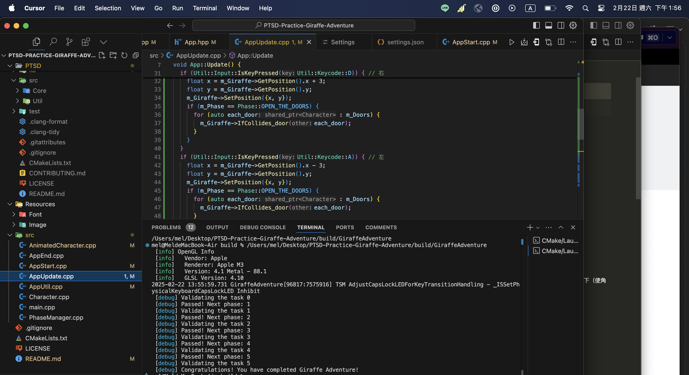

# 作業：長頸鹿大冒險

    

# 遊戲名稱：冰火姐弟

組員：

- 112590014 張孟綺

# Game Introduction

冰姐姐和火弟弟合力闖關。該遊戲包括：5個關卡、觸碰到危險物會死亡、闖關通過即可獲勝
角色操控：
    - 姊姊WD（跳右上）WA(跳左上)W、D（分別代表往右、左平移）｜弟弟利用上下左右鍵做移動
遊戲機關：
    - 推箱子、踩按鈕、推搖桿、搭扶梯、過吊橋、吃寶石

* 關卡難度：
  針對因為該遊戲設置的難度跳升範圍較大，所以只設置2層難度的遞進：

  - 簡易：先水平移動到高平，並設想利用跳躍的方式往上到2F。然後跑跑把搖桿推起來，控制扶梯的上下（到3F）。再跑跑，推箱子到指定按鈕處，控制扶梯的上下（使角色往上層到4F）。最後共同跑到指定的關卡門，觸發獲勝機關。
    破解條件：闖過的過程皆可以吃寶石，已累積分數。若吃到指定寶石數並可破解困難關卡
  - 困難：增加了推搖桿控制上升扶梯和360度旋轉的吊橋（掉下沼澤集會死亡）。
* 角色死亡：
  當冰、火任一角色觸犯遊戲規範時（如：冰姊姊掉入火海、火弟弟掉入冰河｜任一角色掉入沼澤）
* 角色獲勝：
  冰火兩姐弟闖關時皆符合設置的遊戲規範即可獲勝通關

# Development timeline

- Week 1：準備素材

  - [ ] 蒐集遊戲角色、場景、機關等素材
- Week 2：處理遊戲的封面

  - [ ] 處理遊戲封面
  - [ ] 初步開發角色移動與跳躍機制
- Week 3：延續角色移動機制、構思踫撞邊際

  - [ ] 完成開發角色移動與跳躍機制
  - [ ] 構想角色碰撞到邊界的判定
- Week 4：實作碰撞判定與構思基本的設計機關系統

  - [ ] 第一階- 實作碰撞判定
  - [ ] 構思設計機關系統（冰火海、踩按鈕、推搖桿、上升扶梯）
- Week 5：實作碰撞判定和實作機關

  - [ ] 第二階- 實作踫撞判定
  - [ ] 第一階- 實作機關系統（冰火海、踩按鈕、推搖桿、上升扶梯）
- Week 6：實作機關、構思角色死亡、獲勝判定

  - [ ] 第二階- 實作機關系統（冰火海、踩按鈕、推搖桿、上升扶梯）
  - [ ] 構思角色死亡設計、獲勝判定規則
- Week 7：實作角色死亡、獲勝

  - [ ] 第一階段- 實作角色死亡、獲勝
- Week 8：實作角色死亡、獲勝、加入音樂

  - [ ] 第二階段- 實作角色死亡、獲勝
  - [ ] 加入背景音樂
- Week 9：增加第一關的吃寶石任務
  - [ ] 判定累積多少寶石數可達到破解下一關的標準
  - [ ] 第一階- 實作寶石任務的設計
- Week 10：實作第一關的吃寶石任務＆完成前兩關

  - [ ] 第一階- 實作寶石任務的設計
  - [ ] 完成前兩關
- Week 11：構思新的機關系統

  - [ ] 構思新的機關系統（推箱子、360度吊橋、沼澤）

  - --- 進階功能設計 ＆實作其他3個關卡---
- Week 12：實作機關系統（推箱子、360度吊橋、沼澤）

  - [ ] 第一階- 實作系統機關
- Week 13：實作機關系統（推箱子、360度吊橋、沼澤）

  - [ ] 第二階- 實作系統機關
- Week 14：實作機關系統（推箱子、360度吊橋、沼澤）

  - [ ] 第三階- 實作系統機關
- Week 15：實作機關系統（推箱子、360度吊橋、沼澤）

  - [ ] 第四階- 實作系統機關
- Week 16：預留做不完的時間＆完成其他3關
- Week 17：測試、優化程式

...