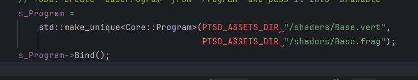

# Abstract

遊戲名稱：StreetFighter2

組員：

- 112590030 郭宇帆
- 112590029 郭柏暘

# Game Introduction
遊戲影片:https://www.youtube.com/watch?v=6OlenbCC4WI

- 這是一個1v1的格鬥遊戲 玩家可以選擇自己的角色與其他角色進行戰鬥 
- 每個角色都有自己的招式 而相同的行為有左右移動 跳躍 蹲姿 格檔 不同的是 輕中重拳頭與輕中重腳 攻擊的距離判定 還有獨自的絕招
- 每一場有三回合 先拿到兩回合者勝利 否則失敗
- 根據不同的按鍵輸入 可以使用(輕中重)拳頭、(輕中重)腳攻擊、絕招、按住面對敵人的反方向鍵可以進行格檔(不損失血量)
- 可以從敵人頭上跳過到另一邊 此時雙方角色會換邊 原本在左角色會換到右 又會換到左 
- 左邊跟右邊人物有時需要輸入的指令會相反 比如:對左邊的角色來說按下⭠會是向後 對右邊的角色來說按下⭠會是向前
- 每個攻擊和絕招的命中都會使敵人損失血量 除非進行格檔
- 每次失敗後都可以選擇要不要接關繼續 不接關則失敗 反之則繼續失敗的關卡 直到打敗所有其他角色

# 個人問題
- 助教你好 我以替換新的框架 但我修改了一些內容 
- 在Text,image,Animation的Draw()的內容 我替換成了之前的void Draw(const Util::Transform &transform, const float zIndex) 請問這樣是可以的嗎
- 還有我會在PTSD架構中新增一些function 但每次從git下載下來後 重新在clion編譯 
- 又會從PTSD的github下載 導致我新增的function被下載的檔案蓋掉 我該要怎麼讓它 不會每次編譯時都下載 而是作為一個資料夾儲存在我的github
- 還有在Image.cpp跟Text.cpp裡的s_Program =std::make_unique<Core::Program>(PTSD_ASSETS_DIR "/shaders/Base.vert",PTSD_ASSETS_DIR "/shaders/Base.frag");
- PTSD_ASSETS_DIR 後的一格會有警示 雖然遊戲能正常執行 但想問問會不會有什麼問題
- 
# Development timeline

# StreetFighter2 開發時程表

- Week 1：準備素材
    - [ ] 蒐集遊戲角色、背景、音效、UI 元素等素材
    - [ ] 確定角色清單與每個角色的基本攻擊與特殊技能
    - [ ] 研究 PTSD 框架，確保素材可適用

- Week 2：開始介面
    - [ ] 設計遊戲封面畫面（標題、開始按鈕等）
    - [ ] 撰寫 `StartScene.hpp` 和 `StartScene.cpp` 以顯示封面並進入選單
    - [ ] 設計角色選擇介面

- Week 3：遊戲場景與基本角色控制
    - [ ] 建立戰鬥場景（背景、地板、血條 UI）
    - [ ] 設計基本角色移動邏輯（左右移動、跳躍、蹲下）
    - [ ] 建立角色翻轉機制（根據位置自動變換左右）

- Week 4：基本攻擊與碰撞判定
    - [ ] 加入攻擊動作（輕中重拳、輕中重腳）
    - [ ] 建立攻擊碰撞判定（Hitbox）
    - [ ] 設定血條機制，攻擊命中時降低對方血量

- Week 5 and 6：特殊招式與防禦機制
    - [ ] 設計角色的特殊招式（如波動拳、昇龍拳等）
    - [ ] 加入防禦機制（玩家按住反方向鍵可以格擋攻擊）
    - [ ] 設定受擊動畫與硬直效果

- Week 7：遊戲規則與回合系統
    - [ ] 設計回合機制（3 回合制，2 勝則獲勝）
    - [ ] 增加時間限制與回合結束的判定
    - [ ] 當血條歸零時，顯示勝負畫面並進入下一回合

- Week 8：單人模式
    - [ ] 設計簡單 AI 讓玩家可對戰電腦
    - [ ] AI 具備基本的攻擊、防禦、隨機行動

- Week 9：音效與視覺特效
    - [ ] 加入打擊音效、角色音效、背景音樂
    - [ ] 增加攻擊命中特效、KO 特效
    - [ ] 調整 UI 讓畫面更有臨場感

- Week 10：關卡與故事模式
    - [ ] 設計角色對戰順序（如街機模式）
    - [ ] 增加簡單的過場動畫或對話系統

- Week 11：角色平衡調整
    - [ ] 針對角色攻擊數值進行平衡調整
    - [ ] 測試所有角色的對戰合理性

- Week 12：介面與使用者體驗（UI）
    - [ ] 測試遊戲的可玩性與體驗流暢度

- Week 13：動畫與特效優化
    - [ ] 改進角色動畫的流暢度
    - [ ] 優化遊戲畫面表現

- Week 14：Bug 修正與最佳化
    - [ ] 測試遊戲並修復 Bug（碰撞異常、輸入延遲等）
    - [ ] 優化遊戲效能，減少運行時的卡頓

- Week 15：測試與調整
    - [ ] 改善可能影響遊戲體驗的問題

- Week 16 17 18：最終優化與更新
    - [ ] 修正 Bug 與問題
