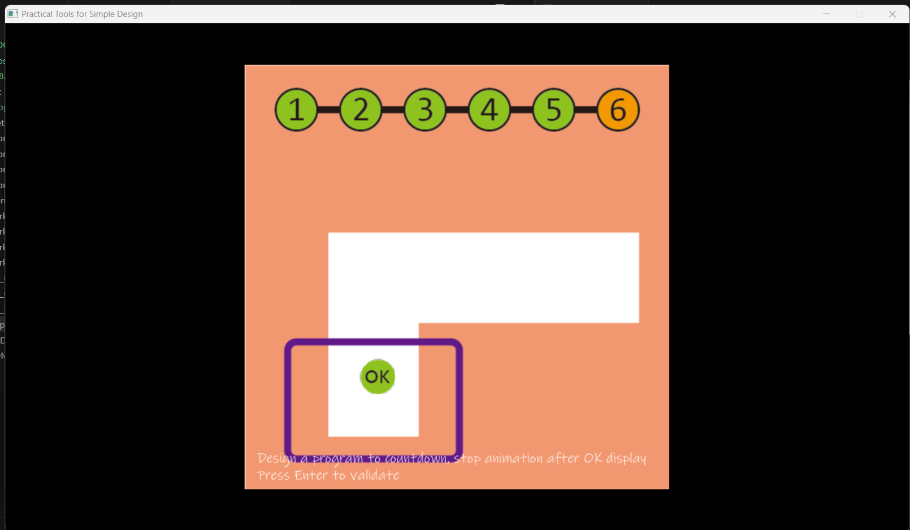

# Abstract

遊戲名稱： AL (Archer's legend)

組員：

- 112820042 杜詠霖

# Game Introduction

這是一款靈感來自《弓箭傳說》的動作冒險爬塔遊戲。
在遊戲中，玩家將扮演一名勇敢的弓箭手，挑戰層層關卡，擊敗各種敵人和強大的首領。每一層塔都有不同的敵人和障礙，玩家需要靈活運用各種技能和走位來應對挑戰。
隨著遊戲進行，玩家可以升級角色、解鎖新技能提升自己的戰鬥力。
# Development timeline
- Week 0：基礎戰鬥系統(角色移動，敵人，箭矢)

- Week 1：完成長頸鹿大冒險+PR
  - [ ] 恩

- Week 2：完成物件Enemy
  - [ ] 並能產生大量敵人(用vector實作)
- Week 3：處理簡易的遊戲的封面及UI介面
  - [ ] 處理遊戲封面的素材
  - [ ] 進行遊戲封面的設計
- Week 4： 完成主角的畫師委託+蒐集敵人圖像素材

- Week 5：完成第一關
  - [ ] 背景
  - [ ] 敵人消失
  - [ ] 進入第二關

- Week 6：設計新敵人(預計繼承enemy)+4關
  - [ ] 會追主角的敵人
  - [ ] 不同關卡的背景
  - [ ] wall完成設計

- Week 7：設計魔王(預計繼承enemy)
  - [ ] 測試
  - [ ] 打完的禮物+跳關金鑰(上上下下左右左右BA)

- Week 8：設計技能
  - [ ] 反彈箭
  - [ ] double箭
  - [ ] ?(還在想)

- Week 9：double箭等技能實作+完成主角的畫師委託

- Week 10：完成未完成的進度

- Week 11：11~20關設計
  - [ ] 新敵人
  - [ ] 會射的敵人

- Week 12：
  - [ ] 完成11~20關
  - [ ]?

- Week 13：動畫設計、主角可跟著滑鼠移動(不一定會做)
  - [ ] 移動時轉向
  - [ ] 想睡覺

- Week 14：可能設計新關卡&敵人

- Week 15：可能設計新關卡&敵人

- Week 16：剷除bug

- Week 17：準備報告

以下是長頸鹿大冒險的截圖
